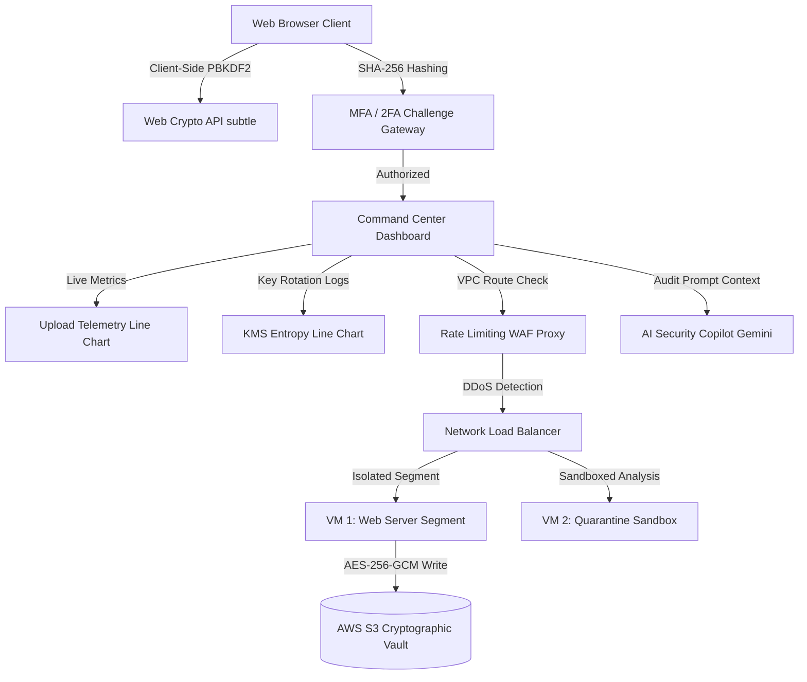

# 🛡️ VCS Secure Cloud Backup & Virtualization Console

🚀 **Production Live Deployment URL**: **[https://pratyush-secure-backup.vercel.app](https://pratyush-secure-backup.vercel.app)**

[](https://github.com/)
[](https://github.com/)
[](https://github.com/)
[](https://github.com/)

An interactive, high-fidelity security control center demonstrating enterprise-grade zero-knowledge cloud backups, virtual compute isolation, real-time telemetry, and AI-assisted compliance analysis. Built with a **luxury deep-space violet glassmorphism** design system.

---

## 🔮 Luxury Glassmorphic Design System

To ensure a state-of-the-art visual aesthetic, the interface utilizes custom dark-mode tokens and neon accent colors:
* **Glassmorphic Panels**: Styled with a translucent backdrop blur (`backdrop-filter: blur(12px)`), dark borders (`border: 1px solid rgba(255,255,255,0.06)`), and deep violet radial glows.
* **Double Contra-Rotating Concentric Rings Logo**: The header and entrance gateways feature concentric SVG rings spinning in opposite directions (`rotate-cw` and `rotate-ccw`) around a central locked shield.
* **Retina Shield Eye Care Filter**: Toggling the blue light shield applies a warm sepia overlay (`sepia(0.3) brightness(0.85)`), dims neon highlights, and pauses glowing grid lines to prevent eye strain.

---

## 🧠 AI-Powered Audit Copilot

The **AI Security Copilot** card provides real-time infrastructure scans:
1. **Gemini Live API Integration**: Input a Gemini API Key to compile active IAM JSON policies, VM lists, and quarantine logs, dispatching them to the live Gemini model (`gemini-2.5-flash`) for advice.
2. **Local Heuristics Fallback**: Without an API key, the dashboard runs a local heuristics engine that parses active permission parameters (checking for wildcard access, ransomware risk tags, and sandboxed ports) to generate dynamic rating scores.
3. **Animated Radar Cone**: Sweeps a radial gradient light cone across the interface during active audit cycles to indicate background analysis.

---

## 📊 Real-Time Telemetry & Dynamic Charts

Features four distinct animated SVG charting consoles:
* **Line Chart 1: Payload Throughput**: Renders dynamic uploads shifting every 2 seconds, filled with a semi-transparent green linear gradient and a pulsing locator dot.
* **Line Chart 2: KMS Key Entropy**: Fluctuates key randomness in real-time, plotting entropy values up to 8.00 bits with a cyan gradient fill.
* **Doughnut Chart: Threat Vector Mitigation**: Breaks down blocked ingress alerts (DDoS, SQL Injection, Port Scans).
* **Bar Chart: Regional Replication Sync**: Tracks synchronization percentages across global server segments.

---

## 📝 Document Exporters (.doc & .ppt)

Enables users to download formatted presentation slides and reports natively in the browser without server dependencies:
* **MS Word Compliance Report (`.doc`)**: Generates structured tables documenting cryptographic boundaries, FIPS controls, VM addresses, and audit logs using a word-compatible HTML template.
* **MS PowerPoint Pitch Deck (`.ppt`)**: Constructs an interactive, keyboard-navigable 5-slide presentation styled in violet glassmorphism detailing the Capstone project.

---

## 🏗️ System Architecture Flow



---

## 🛠️ Installation & Execution

To run this application locally:

1. **Clone the repository**:
   ```bash
   git clone https://github.com/PratyushPandey31/Capstone-Be-project.git
   cd Capstone-Be-project
   ```

2. **Install node dependencies**:
   ```bash
   npm install
   ```

3. **Launch local dev server**:
   ```bash
   npm run dev
   ```
   Open `http://localhost:5173` in your web browser.

4. **Verify production bundle**:
   ```bash
   npm run build
   ```
