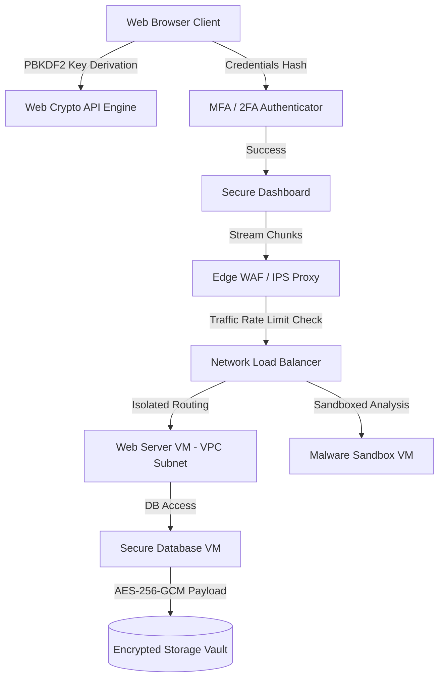

# 🛡️ Secure Cloud Data Backup, Encryption & Virtualization Console

🚀 **Live Production Deployment**: [https://pratyush-secure-backup.vercel.app](https://pratyush-secure-backup.vercel.app)

[](https://github.com/)
[](https://github.com/)
[](https://github.com/)
[](https://github.com/)

An interactive, high-fidelity security dashboard designed to demonstrate enterprise-grade cloud data backup configurations, client-side cryptographic vaults, role-based access controls (RBAC), and virtual network intrusion mitigations. Built with a premium, responsive deep-space violet glassmorphism interface.

---

## 🚀 Key Architectural Modules

### 1. Multi-Factor Authentication Gateway
* **Client-Side Hashing**: User credentials are validated using cryptographic hashing (SHA-256) prior to session verification.
* **Password Strength Entropy Meter**: Evaluates character diversity, length, and entropy requirements in real-time.
* **2FA TOTP Simulator**: Generates rolling 6-digit tokens (Time-based One-Time Passwords) with a 30-second decay timer and mock QR code integration.

### 2. Client-Side Cryptographic Vault
* **AES-256-GCM Core Encryption**: Runs real, high-performance symmetric file encryption inside the browser utilizing standard `SubtleCrypto` APIs.
* **PBKDF2 Key Derivation**: Derives 256-bit keys using PBKDF2-HMAC-SHA256 with 100,000 iterations and random salts to prevent brute-force attacks.
* **SHA-256 Integrity Verification**: Generates payload hashes during upload and checks them post-decryption to enforce end-to-end data integrity.

### 3. Virtualization & WAF Network Topology
* **Hypervisor Node Management**: Spin up/down VM instances. Configure strict Type-1 bare-metal hypervisor isolation versus container level virtualizations.
* **SVG Packet Ingress Visualizer**: Renders active traffic flows from local internet gateways through rate-limiting WAF proxies and load balancers to secure DB segments.
* **IDS/IPS Threat Simulator**: Launch and mitigate simulated real-time attacks including DDoS floods, SQL injections, and Port Scan probes.

### 4. Automated Backup Policy Scheduler
* **Retention and Cron Policies**: Set automated backup cron schedules and target scopes.
* **Compression & Deduplication Analytics**: Tracks disk space savings by comparing SHA-256 block chunk hashes and applying compression ratios.

### 5. IAM Policy & Key Rotation Engine
* **Granular Role Matrix**: Predefined roles (Admins, Operators, Auditors, Viewers) mapping granular policies.
* **KMS Key Rotation Console**: Interactive key rotation panel visualizing envelope wrapping (KEK protecting DEK) with contra-rotating animations.
* **JSON Policy Generator**: Compiles cloud-compliant IAM JSON policy statements reflecting checked permissions on the fly.
* **Credentials Manager**: Issues API access credentials with instant revocation switches.

### 6. Security Audit Exporter & Telemetry
* **Real-Time Telemetry Line Chart**: Visualizes live rolling network payload throughput shifting dynamically every 2 seconds, complete with a leading pulsing locator dot indicator.
* **Audit Report Exporter**: Instantly generates and compiles current virtualization metrics, deduplication metrics, key status, and the latest 50 logs into a formatted `.txt` security audit report.

---

## 📊 System Architecture Flow



---

## 🛠️ Technology Stack

* **Frontend Engine**: React 18, Vite
* **Styling & Theme**: Vanilla CSS Custom Variables (Premium Violet/Indigo theme, glassmorphism, responsive grids)
* **Iconography**: Lucide React SVGs
* **Cryptography**: Web Crypto API (SubtleCrypto)

---

## 💻 Quick Installation & Execution

To run this application locally on your system:

1. **Clone the repository**:
   ```bash
   git clone https://github.com/PratyushPandey31/Capstone-Be-project.git
   cd Capstone-Be-project
   ```

2. **Install project dependencies**:
   ```bash
   npm install
   ```

3. **Launch the local development server**:
   ```bash
   npm run dev
   ```
   Open `http://localhost:5173` in your web browser.

4. **Compile production build**:
   ```bash
   npm run build
   ```

---

## 🔒 Security Compliance Checklist
* **FIPS 140-3**: Configured cryptographic bounds to leverage approved security standards.
* **GDPR Compliance**: User credentials and payload keys are never transmitted to server endpoints; cryptography is performed entirely client-side.
* **WORM Storage**: Default IAM rules deny deletion (`s3:DeleteObject`) to enforce Write-Once-Read-Many properties for backup archives.
