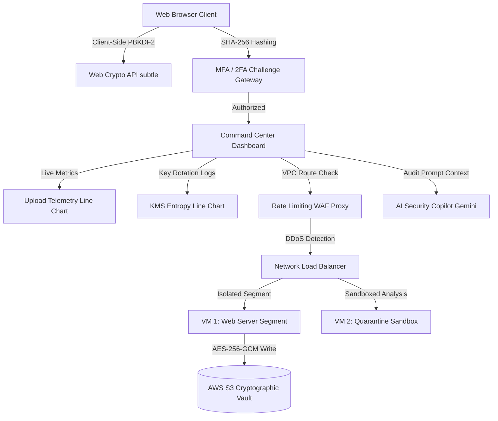

# 🛡️ VCS Secure Cloud Backup & Virtualization Control Center

🚀 **Production Live Deployment**: **[https://pratyush-secure-backup.vercel.app](https://pratyush-secure-backup.vercel.app)**

[](https://github.com/)
[](https://github.com/)
[](https://github.com/)
[](https://github.com/)
[](https://github.com/)

An enterprise-grade cloud storage console designed to showcase zero-knowledge client-side encryption, bare-metal virtual compute segmentations, interactive network threat containment, and automated KMS key rotation compliance. Built on a premium, responsive **glassmorphic deep-space violet** architecture.

* **Subject Domain**: Virtualization and Cloud Security
* **Academic Mentor**: Developed under the guidance and support of **Dr. Ditixa Mehta**.

---

## 🔮 Enterprise Architectural Modules

### 1. Zero-Knowledge Cryptographic Vault
* **Approved Algorithms**: Utilizes high-performance **AES-256-GCM** (Galois/Counter Mode) block encryption running natively inside the browser via the `SubtleCrypto` library.
* **Key Derivation (KDF)**: Stretch client passwords using **PBKDF2-HMAC-SHA256** with **100,000 iterations** and cryptographically secure random salts.
* **Integrity Audit**: Computes SHA-256 hash digests of raw payloads before upload and compares them post-decryption to enforce tamper-detection bounds.

### 2. KMS Envelope Key Rotation
* **Key Hierarchy**: Visualizes the **Envelope Encryption** structure, where a master Key Encryption Key (KEK) wraps and protects a local Data Encryption Key (DEK).
* **Automated Rotation**: Shuffling multi-region key rings generates new KEK ARNs and triggers background re-encryption of data keys.
* **Policy Compiler**: Attach granular role permissions (Admin, Operator, Auditor, Viewer) that compile into cloud-compliant IAM JSON policy statements in real-time.

### 3. Virtualization Node Management & WAF
* **Compute Sandboxing**: Manage bare-metal hypervisor virtual machines. Configure Type-1 physical isolation versus container sandboxing.
* **Network Ingress Visualizer**: Real-time SVG packet lines mapping routing paths from local gateways through WAF proxies to secure DB clusters.
* **Threat Mitigation Engine**: Simulate and isolate live network attacks including DDoS floods, SQL injection query parameters, and port scan knock probes.
* **Emergency Lockdown Protocol**: Revokes all programmatic keys and cuts compute node subnets instantly.

### 4. AI Compliance Copilot
* **Gemini LLM Audit**: Paste a Gemini API Key to run automated cloud security evaluations, transmitting policy structures to the live model for remediation steps.
* **Local Heuristic Scans**: Without an API key, a local static rule scanner checks for wildcard access configurations and unsandboxed VM status.
* **SVG Radar Scan Sweep**: Displays an animated radial radar cone rotating across concentric circles during audit execution.

---

## 📝 Document Exporters (.doc & .ppt)

Downloads formatted slideshow presentations and reports directly from browser memory:
* **MS Word Compliance Report (`.doc`)**: Formats tables detailing cryptographic boundaries, active IAM policy rules, VM status, and security logs with inline SVG charts.
* **MS PowerPoint Pitch Deck (`.ppt`)**: Generates an interactive, keyboard-navigable 7-slide presentation styled in violet glassmorphism describing the Capstone architecture.

---

## 🏗️ System Architecture Flow



---

## 🔒 Corporate Security Principles Met

* **Least Privilege Enforcement**: RBAC configurations prevent non-admin scopes from executing master key rotations or VM status changes.
* **Separation of Duties**: Built-in Auditor warnings alert teams if compliance auditors request decryption rights (`kms:Decrypt`) that bypass read-only bounds.
* **Ransomware WORM Immutability**: Implements automated retention crons and denies object deletes (`s3:DeleteObject`) by default to protect backups.
* **Retina Shield mode**:Dimmed glow filters protect compliance officers from visual fatigue during long monitoring cycles.

---

## 🛠️ Quick Installation Guide

To run this console locally:

1. **Clone the repository**:
   ```bash
   git clone https://github.com/PratyushPandey31/Capstone-Be-project.git
   cd Capstone-Be-project
   ```

2. **Install dependencies**:
   ```bash
   npm install
   ```

3. **Launch the local development server**:
   ```bash
   npm run dev
   ```
   Open `http://localhost:5173` in your web browser.

4. **Verify production bundle**:
   ```bash
   npm run build
   ```
